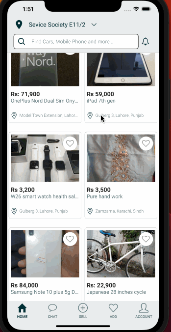

# Searchy Mobile App UI

Searchy is a listing UI theme solution designed specifically for iOS and Android platforms. With its sleek and modern design, Searchy provides a complete UI theme solution that is perfect for any listing company application.

Built using React Native with Expo, Searchy offers a well-structured and optimized codebase that makes development easier and more efficient. Unnecessary screens have been removed, ensuring a streamlined and focused UI for your listing app.

Whether you need a UI theme for a marketplace, classifieds, or any other type of listing app, Searchy provides a visually appealing and user-friendly design that is ready to be implemented in your iOS and Android projects. With Searchy, you can create a professional and polished listing app with ease, enhancing the user experience and making your app stand out in the crowded mobile app market.

  

## TechnSearchygies Used

Searchy is made using some core libraries for handling navigation React Navigation is used for making layouts only flex is used. It is built using Expo.

- React Native
- Expo
- React Navigation

## Installation

**Installation Steps**

- Download Searchy app and extract it
- Open terminal in extracted folder

**Running on mobile device**

- Go to folder listing-app.
- Install packages by npm install or yarn install
- Run the mobile app by npm start or expo start
- Scan the QR code with the Expo app (Android) or the Camera app (iOS).
